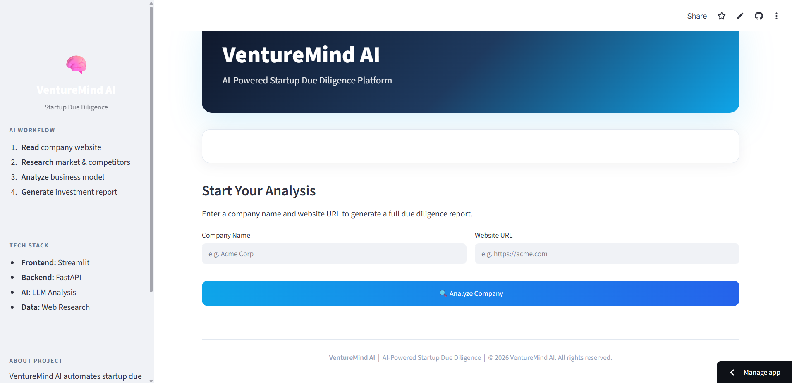
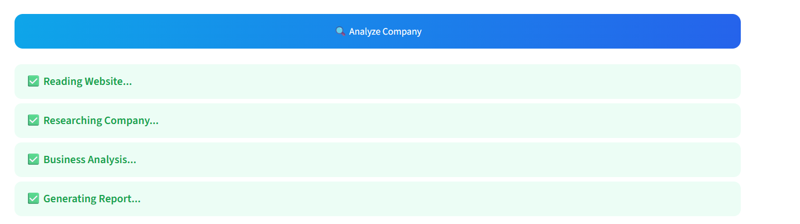
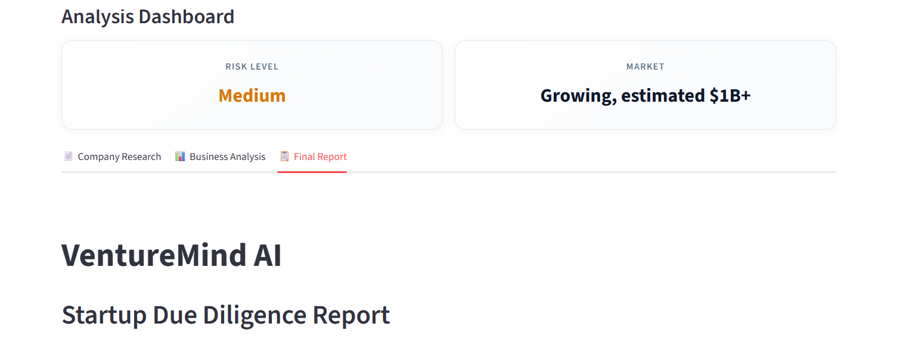
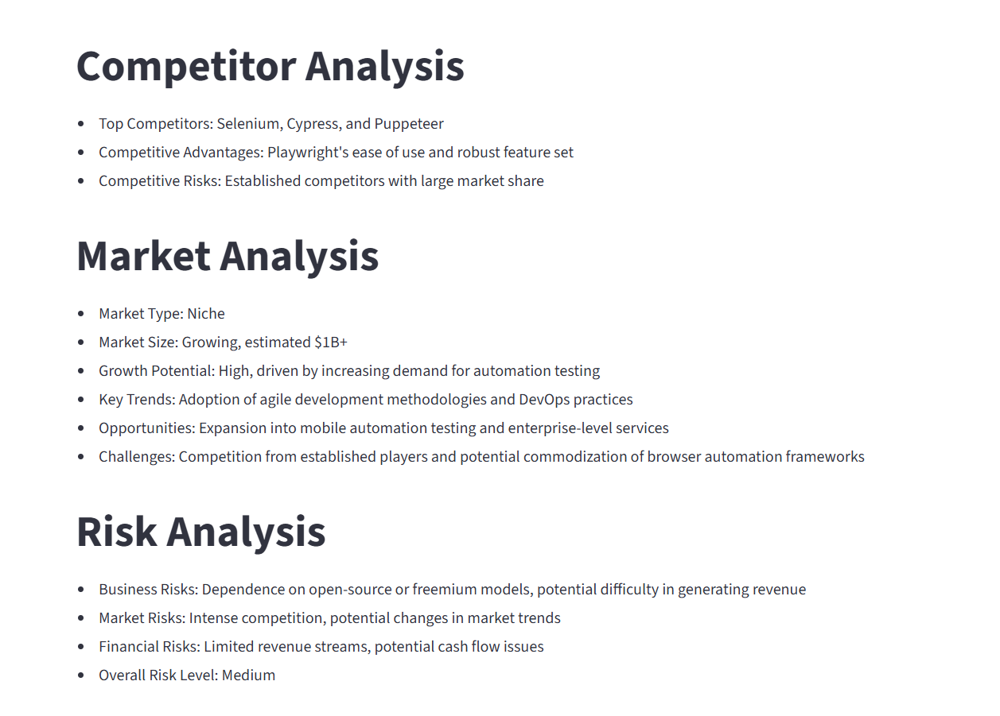

# 🚀 VentureMind AI

> AI-Powered Multi-Agent Startup Due Diligence Platform

VentureMind AI is an AI-powered startup analysis platform that performs automated due diligence using multiple AI agents. It analyzes startup websites and generates structured investment insights, including company research, business analysis, market opportunities, risk assessment, and investment recommendations.

---

## 🌐 Live Demo

Frontend:
https://venturemind-ai-abdutoq2k6mgkuvgvcqzw7.streamlit.app

Backend API:
https://venturemind-ai-api.onrender.com

---

## 📸 Screenshots

### 🏠 Home Page



---

### Analysis




---

### Dashboard



---

### AI Generated Report



---

## ✨ Features

- 🤖 Multi-Agent AI Architecture
- 🌐 Website Content Extraction
- 🏢 Startup Company Research
- 📊 Business Analysis
- 📈 Market Analysis
- ⚔️ Competitor Analysis
- ⚠️ Risk Assessment
- 💡 AI Investment Recommendation
- 📄 Professional Due Diligence Report
- 🎨 Interactive Streamlit Dashboard
- ⚡ FastAPI Backend
- ☁️ Cloud Deployment using Render & Streamlit Cloud

---

## 🏗️ Architecture

```
                User

                  │

                  ▼

          Streamlit Frontend

                  │

                  ▼

            FastAPI Backend

                  │

                  ▼

          LangGraph Workflow

                  │

    ┌──────────┬──────────────┬──────────────┐
    ▼          ▼              ▼              ▼

Website    Research      Business      Report
 Agent       Agent        Analysis      Agent

                  │

                  ▼

             Groq LLM
```

---

## 🛠️ Tech Stack

### Frontend

- Streamlit

### Backend

- FastAPI
- Uvicorn

### AI Framework

- LangChain
- LangGraph

### LLM

- Groq
- Llama 3

### Web Scraping

- BeautifulSoup
- Playwright

### Deployment

- Render
- Streamlit Community Cloud

---

## 📂 Project Structure

```
venturemind-ai/

│

├── agents/

│ ├── website_agent.py

│ ├── research_agent.py

│ ├── business_analysis_agent.py

│ └── report_agent.py

│

├── api/

│ └── main.py

│

├── frontend/

│ └── app.py

│

├── models/

│ ├── llm.py

│ └── state.py

│

├── tools/

│

├── requirements.txt

└── README.md
```

---

## ⚙️ Installation

Clone the repository

```bash
git clone https://github.com/Sukesh1953/venturemind-ai.git
```

Move into the project

```bash
cd venturemind-ai
```

Install dependencies

```bash
pip install -r requirements.txt
```

Create a `.env` file

```text
GROQ_API_KEY=your_api_key_here
```

Run FastAPI

```bash
uvicorn api.main:app --reload
```

Run Streamlit

```bash
streamlit run frontend/app.py
```

---

## 📊 Workflow

1. User enters a startup name and website.
2. Website Agent extracts website content.
3. Research Agent generates company insights.
4. Business Analysis Agent performs:
   - Competitor Analysis
   - Market Analysis
   - Risk Analysis
5. Report Agent creates a structured due diligence report.
6. Results are displayed in the Streamlit dashboard.

---

## 🚀 Future Improvements

- PDF Report Download
- Investment Score Dashboard
- Financial Statement Analysis
- Crunchbase Integration
- Pitch Deck Analysis
- Multi-Agent Memory
- Vector Database Integration
- RAG-based Knowledge Retrieval
- Authentication & User Accounts
- Report History
- Investor Portfolio Dashboard

---

## 💼 Use Cases

- Venture Capital Firms
- Angel Investors
- Startup Accelerators
- Incubators
- Business Consultants
- Investment Analysts
- Entrepreneur Research

---

## 👨‍💻 Author

**Sukesh Padagatti**

GitHub:
https://github.com/Sukesh1953

---

## ⭐ Support

If you found this project helpful, consider giving it a ⭐ on GitHub.

It helps others discover the project and supports future development.
